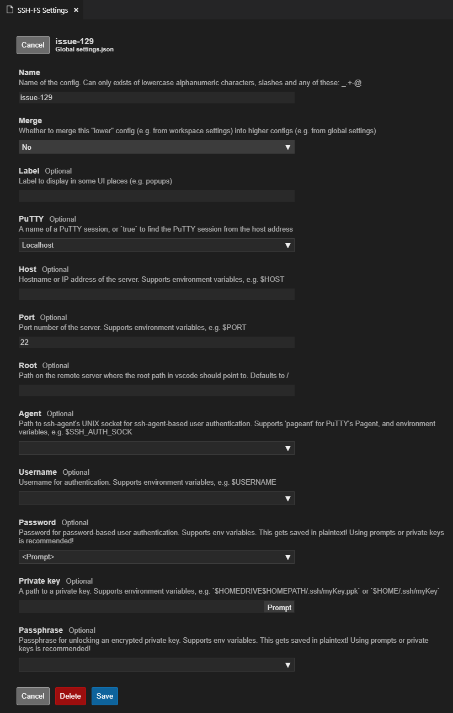
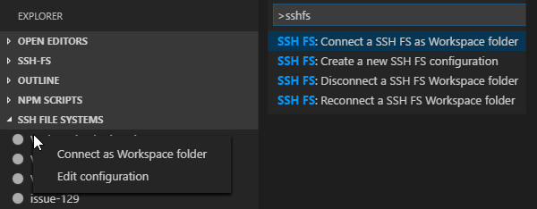

# SSH FS

 

 

This extension makes use of the new FileSystemProvider, added in version 1.23.0 of Visual Studio Code. It allows "mounting" a remote folder over SSH as a local Workspace folder.

## Summary
* Use a remote directory (over SSH) as workspace folder
* A built-in UI to add, edit and remove configurations
* Use agents, including Pageant and OpenSSH on Windows
* Use private keys (any supported by ssh2-streams, including PuTTY's PPK)
* Get prompted for a password/passphrase (plain text password aren't required)
* Easily create configurations that reference a PuTTY session/configuration
* Have multiple SSH (and regular) workspace folders at once
* Make use of SOCKS 4/5 and HTTP proxies and connection hopping

## Usage
Use the command `SSH FS: Create a SSH FS configuration`, or open the Settings UI using the `SSH FS: Open settings and edit configurations` and click Add:

In this UI, you can also edit/delete existing configurations:

To connect, either rightclick the name in the Explorer tab, or use the command panel:

This will add a Workspace folder linked to a SSH (SFTP) session:

